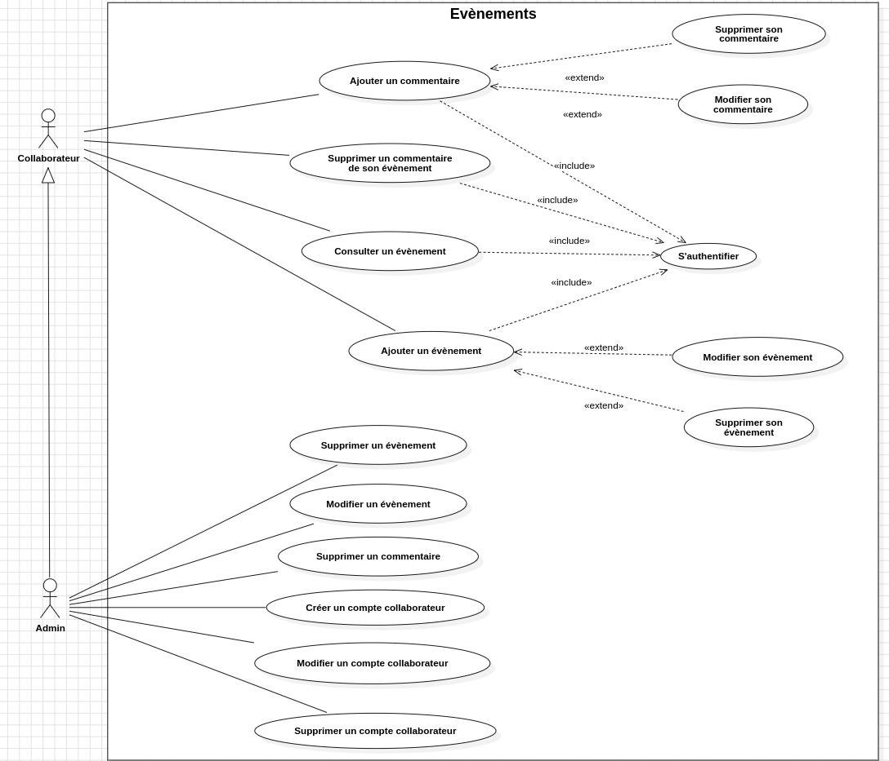
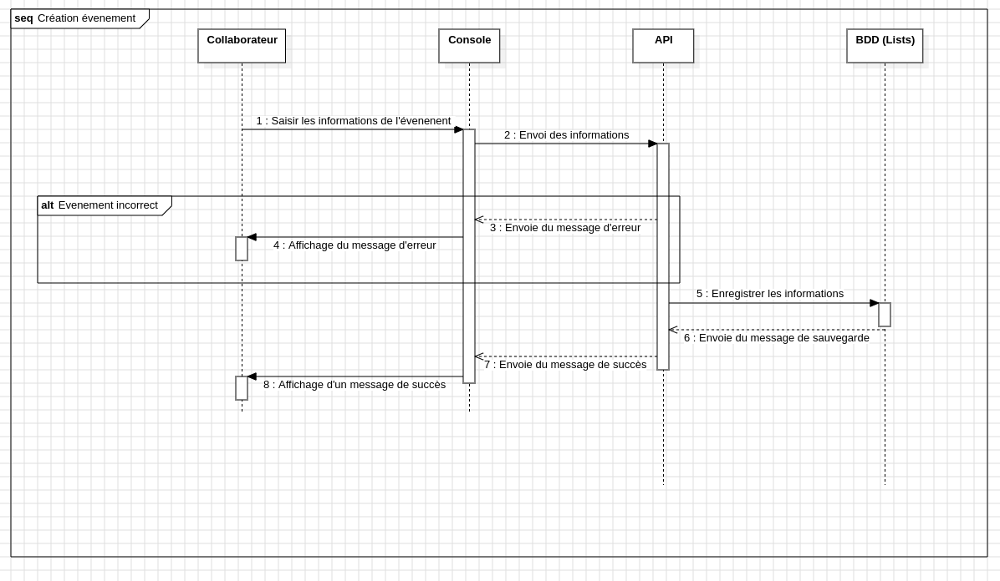
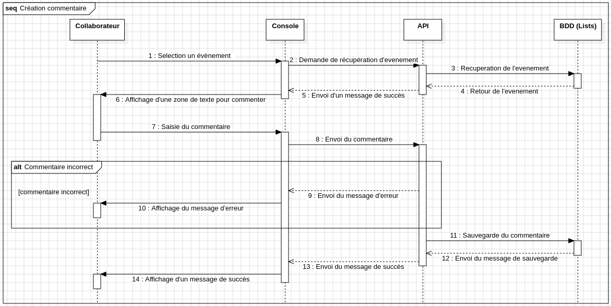

## **README pour le projet Corpo Event**

### 📚 **Contexte du projet**
Une entreprise souhaite partager les événements qu'elle organise avec l'ensemble de ses collaborateurs. Cependant, ces derniers sont répartis sur de nombreux sites, et les mails envoyés ne sont pas toujours lus.  
**Objectif :** Concevoir et développer une plate-forme permettant de :
- Partager des événements futurs.
- Permettre aux collaborateurs de proposer de nouveaux événements.
- (Optionnel) Ajouter des commentaires sur les événements.

---

### 🎯 **Objectifs pédagogiques**
- Analyser le besoin pour construire un **diagramme de cas d'utilisation**.
- Élaborer un **diagramme de classes** pour définir la structure du projet.
- Concevoir des **diagrammes de séquences** pour modéliser les interactions entre classes.
- Développer des fonctionnalités en respectant les principes de la **POO** (SOLID, etc.).

---

### 🛠️ **Technologies utilisées**
- **Langage** : Java (version 21)
- **Framework** : Aucun pour ce projet (POO pure)
- **Outils** : IntelliJ IDEA / Eclipse, GitHub, UML Designer

---

### 🚀 **Livrables**
Le dépôt GitHub contient les éléments suivants :
- **Dossier conception :**
  - Diagramme de cas d'utilisation
  - Diagramme de classes
  - Diagramme de séquences
- **Sources :** Code source respectant les principes de la POO.

Lien du repo GitHub : [Corpo Event](https://github.com/Simplon-hdf/corpo-event-grogneur-coupant)

---

### 🖥️ **Structure du projet**
```bash
corpo-event/
│
├── src/
│   ├── model/
│   │   ├── Collaborateur.java
│   │   ├── Evenement.java
│   │   └── Commentaire.java
│   ├── repository/
│   │   ├── CollaborateurRepository.java
│   │   ├── EvenementRepository.java
│   │   └── CommentaireRepository.java
│   └── main/
│       └── Main.java
│
├── docs/
│   ├──regles-gestion.md
│   ├── uml/
│       ├── use_case_diagram.png
│       ├── class_diagram.png
│       └── diagramme-sequence/
│           ├── creation-commentaire.png
│           ├── creation-evenement.png
│
└── README.md
```

---

### 🔍 **Diagrammes**

#### 1. **Diagramme de cas d'utilisation**


#### 2. **Diagramme de classes**


#### 3. **Diagramme de séquences pour la création d'un évenement**


#### 4. **Diagramme de séquences pour la création d'un commentaire**


---

### 📑 **Fonctionnalités développées**
1. **Gestion des collaborateurs :**
   - Création, modification, suppression, recherche.
   
2. **Gestion des événements :**
   - Ajout, modification, suppression, recherche par ID.
   - Affichage de tous les événements.

3. **(Optionnel) Gestion des commentaires :**
   - Ajout de commentaires à un événement.

---

### 💡 **Principes SOLID appliqués**
- **S** : Responsabilité unique (chaque classe gère un aspect spécifique).
- **O** : Ouverture/Fermeture (le système est extensible sans modification de code existant).
- **L** : Substitution de Liskov (les sous-classes peuvent remplacer leurs super-classes).
- **I** : Ségrégation des interfaces (interfaces spécifiques et concises).
- **D** : Injection de dépendances (si applicable, à développer ultérieurement).

---

### 📋 **Comment exécuter le projet**
1. Clone le repo :
   ```bash
   git clone https://github.com/Simplon-hdf/corpo-event-grogneur-coupant.git
   cd corpo-event
   ```
2. Compile et exécute le projet :
   ```bash
   javac -d bin src/**/*.java
   java -cp bin main.Main
   ```

---

### ✅ **Critères d'évaluation**
- **Exhaustivité des fonctionnalités dans les diagrammes.**
- **Fonctionnalités développées dans le respect des principes POO.**
- **Clarté et structure du code.**
- **Respect des principes SOLID.**

---

### ✨ **Améliorations possibles**
- Ajouter une interface utilisateur (web ou console interactive).
- Intégrer une base de données pour la persistance des données.
- Ajouter des tests unitaires pour garantir la robustesse du code.

---